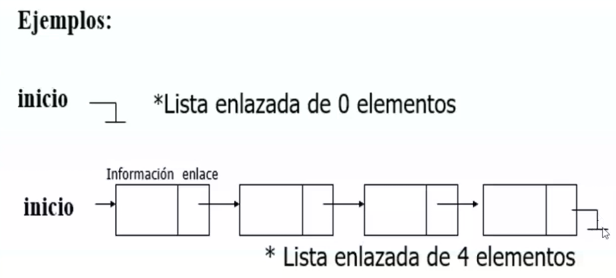

# Cursada Progra II
 
## Instanciar
No tiene sentido instanciar un método si siempre va a devolver el mismo resultado sin importar que dato le pase.

##Costos estructuras dinámicas/estáticas
* Las estructuras dinámicas tienen mejor uso del costo espacial pero mayor costo de procesamiento.
* Las estructuras estáticas tienen mejor uso del costo de procesamiento pero menor eficacia del uso espacial.

#Costos implementaciones estáticas
* Costo constante: no cambia en función de la cantidad de elementos que tiene el TDA
* Costo lineal (variable): cambia en función a la cantidad de elementos que tenga el TDA. L(2n) en las colas con prioridad significa que el costo se multiplica por dos (elemento y prioridad), pero no es polinómico.
* Costo polinómico (variable): lo tienen únicamente los árboles

#Costos implementaciones dinámicas

##PilaTF - Tope al Final
* Orden de ingreso 0, 1, 2, 3, 4, 5, 
* Queda ordenado: 0,1,2,3,4,5(tope)
* Es más eficiente tanto apilar como desapilar
* El costo es constante

##PilaTI - Tope al Inicio
* Orden de ingreso 0, 1, 2, 3, 4, 5, 
* Queda ordenado: (tope)5, 4, 3, 2, 1, 0
* Menos eficiente al apilar y desapailar
* El costo es variable

##Colas
Se acola por el final y se desacola por el principio. 
* Si es barato acolar es caro desacolar, o viceversa

##ColaPU - Primero a lo último
Se acola 0,1,2,3,4,5
* Queda ordenado: 5,4,3,2,1,0(primero)
* Es caro acolar(variable) pero barato desacolar(constante)

##ColaPI - Primero al inicio
Se acola 0,1,2,3,4,5
* Queda ordenado: (primeroo)0,1,2,3,4,5
* Es barato acolar (constante) y caro desacolar (variable)

##Cola con Prioridad
*El costo obligatorio va a estar en acolar por la prioridad, por lo tanto, se utiliza ColaPU para mantener el desacolar barato.
* Cuando se acola se correa a la derecha
* ColaPrioridadDA = dos arrays
* ColaPrioridadAO = array objeto (usa un solo array)

##Conjuntos
* ConjuntoTA = To Array
* ConjuntoLD = Lista Dinámica

##Conjunto Acotado
* 1001011 (binario)
* 0123456 (indice)

* Se indica en binario los valores que están guardados (los valores son las claves)

##Diccionario
* Clase > Identificador > No se puede repetir
* Valores > Elementos > Se pueden repetir > Siempre están asociados a una clave

* El diccionario simple tiene un solo valor asociado a cada clave
* El diccionario múltiple tiene uno o más valores asociados a cada clave

#Litas dinámicas
* Es un conjuto de nodos
* Los nodos son estructuras que tienen el valor (info) y la referencia (sig) al siguiente nodo. El último nodo tiene el elemento y la referencia es "null"

* Las referencias son recursivas
* Hay dos estrategias: Agregar al inicio (es mas barato) o Agregar al final (solo se usa en las colas "sin prioridad")
* En la inicialización de los TDA el nodo va a ser NULL
